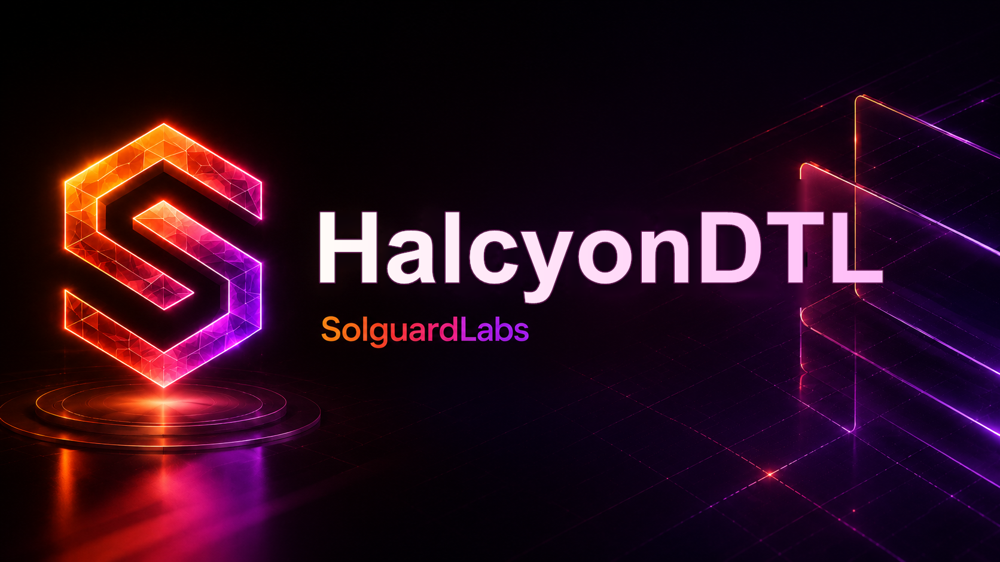

# HalcyonDTL



HalcyonDTL es un motor Go de financiacion dinamica para rutas DTL. Modela
operadores, vaults de liquidez, rutas, posiciones con margen, epochs de
funding, liquidaciones y reportes JSON deterministas para auditorias.

El binario es local y no necesita servicios externos. Los tests TypeScript
ejecutan la CLI y validan escenarios publicos de funding, apertura de rutas,
cierre de posiciones y liquidaciones normales.

## Componentes

- `src/amount.go`: aritmetica entera, basis points y funding en PPM.
- `src/ids.go`: identificadores canonicos de cuentas, rutas, operadores y posiciones.
- `src/asset.go`: registro de activos, parametros de margen y penalizacion.
- `src/account.go`: balances de usuarios, margen, funding realizado y cursor operativo.
- `src/operator.go`: operadores, rebates y balances por ruta.
- `src/vault.go`: vaults de liquidez, reservas, seguros y obligaciones.
- `src/route.go`: rutas DTL con utilizacion, limites y acumulador de funding.
- `src/funding.go`: calculo de tasas por epoch y acumuladores por ruta.
- `src/position.go`: lifecycle de posiciones sobre rutas.
- `src/liquidation.go`: ejecucion de liquidaciones bajo margen de mantenimiento.
- `src/engine.go`: estado principal y transiciones economicas.
- `src/scenario.go`: escenarios deterministas usados por la CLI.
- `src/report.go`: contrato JSON estable para tests externos.
- `src/risk.go`: invariantes de auditoria y metricas de solvencia.
- `src/cli.go`: CLI `halcyondtl`.

## Requisitos

- Go 1.22 o superior.
- Node.js 24 o superior.

## Uso

Compilar:

```bash
node scripts/build.mjs
```

Listar escenarios:

```bash
out/halcyondtl --list
```

Ejecutar un escenario:

```bash
out/halcyondtl scenario funding
```

Validar invariantes:

```bash
out/halcyondtl validate open-close
```

## Tests

```bash
npm test
```

La suite publica cubre:

- contrato CLI y salida JSON;
- calculo de funding rates por utilizacion;
- apertura de rutas y posiciones;
- cierre normal con funding acumulado;
- liquidacion normal cuando el margen cae por debajo de mantenimiento.

## Estado Del Lab

HalcyonDTL esta pensado como repositorio CTF autocontenido. La vulnerabilidad
intencional se documenta localmente en `vulnerability.md`, que queda excluido
por `.gitignore` para no publicarlo en el repositorio del reto.

