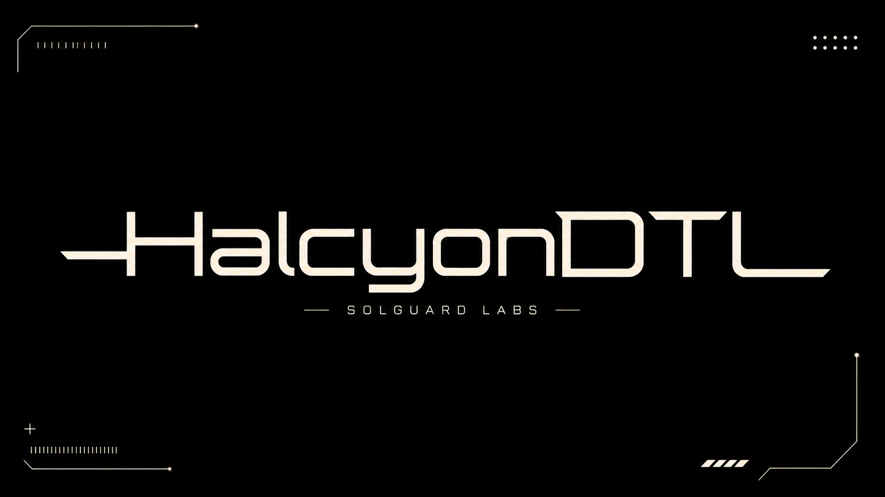
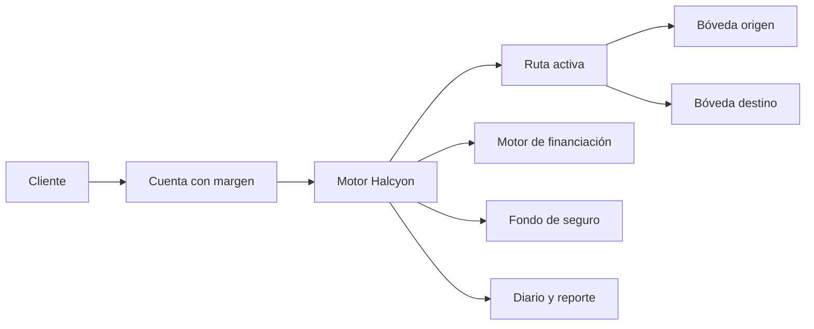
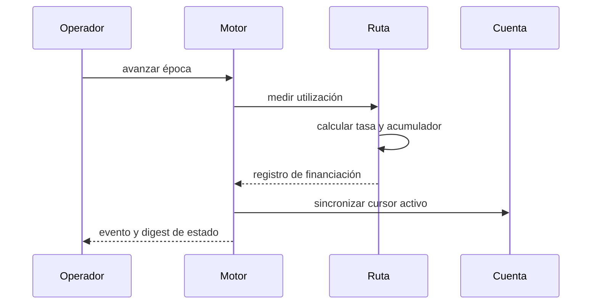
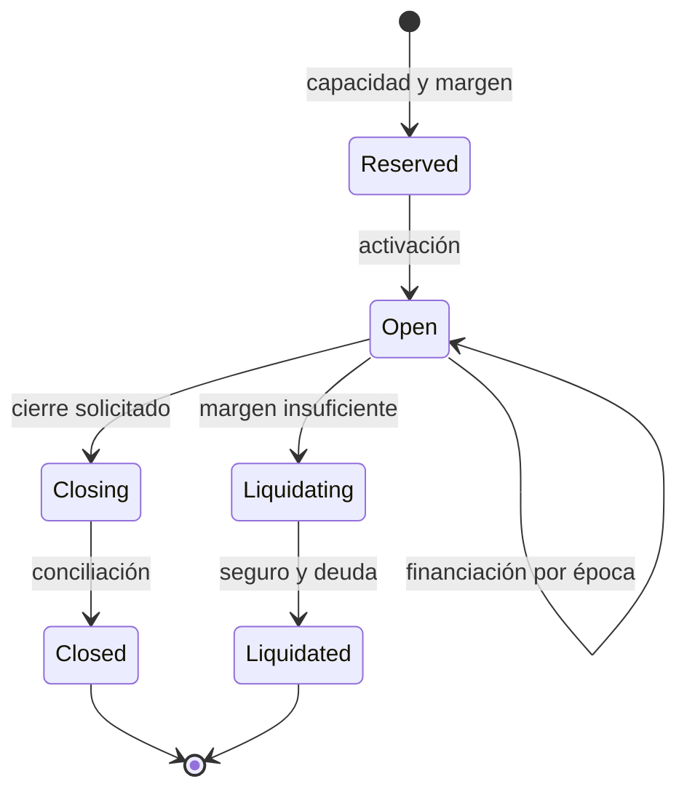
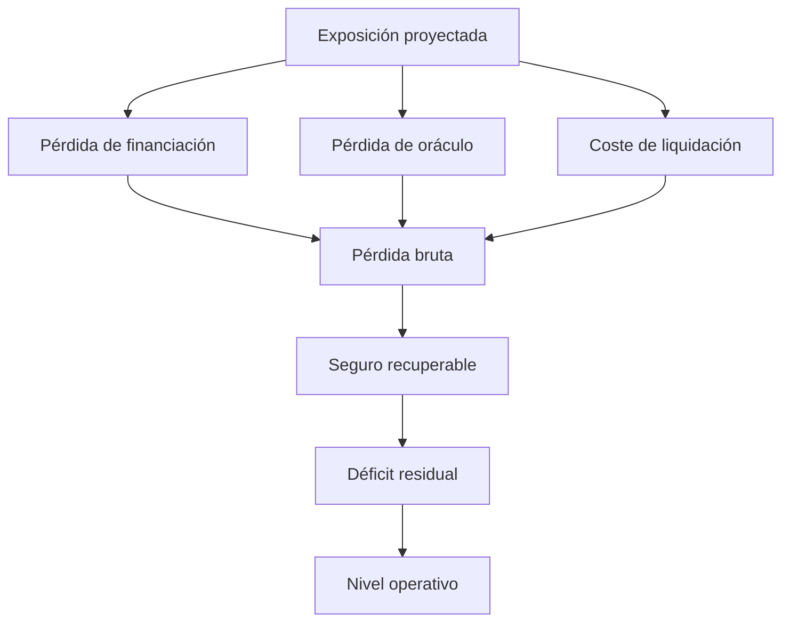

# HalcyonDTL



HalcyonDTL es un motor determinista de liquidez distribuida escrito en Go. Coordina rutas entre bóvedas, posiciones con margen, financiación dinámica, rotación operativa y liquidaciones, y publica un informe JSON estable para integración y observabilidad. La distribución incluye un cliente Node sin dependencias de ejecución.

## Capacidades

- Libro de activos, operadores, bóvedas, cuentas, rutas y posiciones.
- Curva de financiación por utilización con pendiente y límite configurables.
- Reserva y liberación de capacidad con contabilidad por ruta.
- Liquidación, seguro, deuda socializada y conciliación de comisiones.
- Proyección de estrés con cascada de pérdidas totalmente desglosada.
- Diario ordenado, resumen de riesgo e invariantes verificables.
- CLI determinista y cliente Node con validación estricta.


```mermaid
flowchart LR
    C["Cliente"] --> A["Cuenta con margen"]
    A --> E["Motor Halcyon"]
    E --> R["Ruta activa"]
    R --> V1["Bóveda origen"]
    R --> V2["Bóveda destino"]
    E --> F["Motor de financiación"]
    E --> P["Fondo de seguro"]
    E --> J["Diario y reporte"]
```

## Modelo de financiación

Cada ruta calcula su tasa por época a partir de la desviación respecto de la utilización objetivo:

```text
u       = (utilizado + reservado) / liquidez
ratePPM = clamp((objetivoBps - uBps) × pendientePPM / 10 000, -límite, +límite)
A[t+1]  = A[t] + ratePPM
funding = nocional × (A[salida] - A[entrada]) / 1 000 000
```

Un valor negativo carga financiación al margen; uno positivo genera crédito. Todos los importes usan enteros y una dirección de redondeo explícita.


```mermaid
sequenceDiagram
    participant O as Operador
    participant E as Motor
    participant R as Ruta
    participant A as Cuenta
    O->>E: avanzar época
    E->>R: medir utilización
    R->>R: calcular tasa y acumulador
    R-->>E: registro de financiación
    E->>A: sincronizar cursor activo
    E-->>O: evento y digest de estado
```

## Inicio rápido

Requisitos: Go 1.22.12 o compatible y Node.js 24.

```bash
npm ci
npm run build
./out/halcyondtl --list
./out/halcyondtl scenario funding
./out/halcyondtl validate routes
```

En Windows, el ejecutable se crea como `out/halcyondtl.exe`. Para usar una instalación concreta de Go:

```powershell
$env:GO_BIN = "C:\ruta\a\go.exe"
$env:GOFMT_BIN = "C:\ruta\a\gofmt.exe"
npm run ci
```

## Flujo de una posición


```mermaid
stateDiagram-v2
    [*] --> Reserved: capacidad y margen
    Reserved --> Open: activación
    Open --> Open: financiación por época
    Open --> Closing: cierre solicitado
    Open --> Liquidating: margen insuficiente
    Closing --> Closed: conciliación
    Liquidating --> Liquidated: seguro y deuda
    Closed --> [*]
    Liquidated --> [*]
```

## Proyección de estrés

`ProjectLiquidityStress` calcula la exposición agregada y aplica una cascada reproducible:

1. pérdida por choque de financiación;
2. recorte de valoración del oráculo;
3. coste de liquidación;
4. seguro recuperable;
5. déficit residual y nivel operativo.


```mermaid
flowchart TD
    X["Exposición proyectada"] --> F["Pérdida de financiación"]
    X --> O["Pérdida de oráculo"]
    X --> L["Coste de liquidación"]
    F --> G["Pérdida bruta"]
    O --> G
    L --> G
    G --> I["Seguro recuperable"]
    I --> D["Déficit residual"]
    D --> S["Nivel operativo"]
```

El modelo no usa coma flotante. Cada proyección expone sus términos intermedios para que operaciones, riesgo y auditoría puedan reconciliar el resultado.

## Cliente Node

```js
import { HalcyonClient } from "halcyondtl";

const client = new HalcyonClient({ timeout: 5_000 });
const report = client.runScenario("funding");
console.log(report.state_digest, report.risk);
```

El cliente rechaza nombres no canónicos, no invoca una shell, limita la salida y entrega objetos profundamente inmutables.

## Comandos de calidad

| Comando                  | Garantía                                   |
| ------------------------ | ------------------------------------------ |
| `npm run format:check`   | Formato Prettier y gofmt sin mutaciones    |
| `npm run test:go`        | Pruebas unitarias y de modelo económico    |
| `npm run test:node`      | Contrato CLI, escenarios e integración     |
| `npm run loc`            | Presupuesto controlado de fuente Go        |
| `npm run verify:release` | Documentación, activos y fuentes aprobadas |
| `npm run ci`             | Puerta local completa                      |

## Documentación

- [Arquitectura](docs/arquitectura.md)
- [Modelo económico](docs/modelo-economico.md)
- [Operación](docs/operacion.md)
- [Controles de riesgo](docs/controles-de-riesgo.md)
- [Cliente Node](docs/cliente-node.md)
- [Observabilidad](docs/observabilidad.md)
- [Gobernanza](docs/gobernanza.md)
- [Política de seguridad](SECURITY.md)

## Estado de versión

La rama `production` y la etiqueta anotada `v1.0.0` representan el mismo commit aprobado. La automatización comprueba Linux y Windows, y valida nuevamente la integridad al publicar la versión.

## Licencia

MIT. Consulta [LICENSE](LICENSE).
