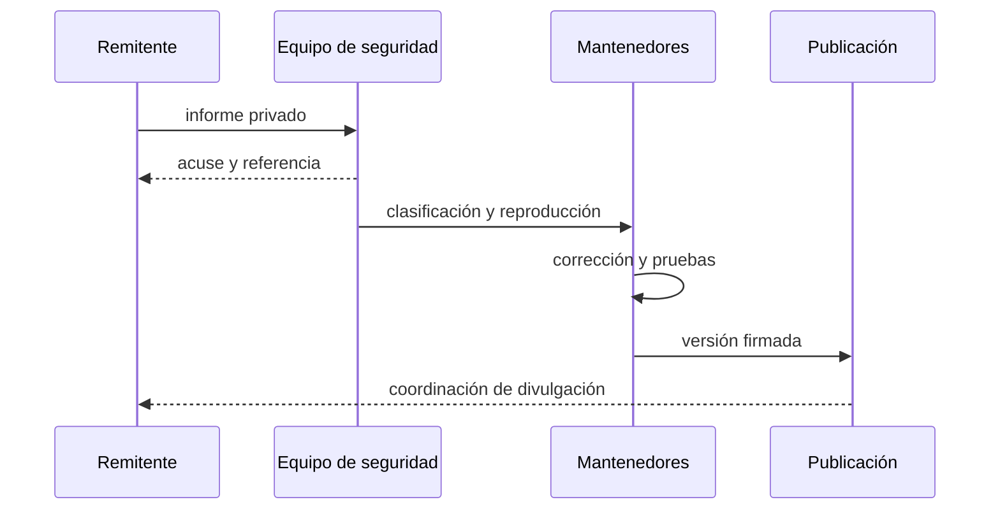

# Política de seguridad

## Versiones mantenidas

| Serie      | Estado            | Canal        |
| ---------- | ----------------- | ------------ |
| 1.0.x      | Mantenida         | `production` |
| anteriores | Sin mantenimiento | —            |

## Comunicación responsable

No publiques detalles técnicos sensibles en incidencias, discusiones ni solicitudes de cambio. Utiliza **Security → Report a security issue** en GitHub. Incluye versión, commit, componente, precondiciones, impacto contable, reproducción mínima y una propuesta de corrección si está disponible.

Acusaremos recibo en un máximo de dos días laborables. La clasificación inicial se realiza en cinco días laborables. Los plazos de corrección dependen de la severidad y de la capacidad de desplegar una migración segura.

## Perímetro de seguridad

Se consideran sensibles los cambios que afecten a autorización de operadores, transiciones de estado, cálculo de tasas, acumuladores, liquidaciones, reserva, seguro, deuda, conciliación de activos, serialización, dependencias y automatización.

## Controles de publicación

La publicación requiere historial lineal, comprobaciones verdes y coincidencia de commit entre `main`, `production` y la etiqueta. Los secretos no deben formar parte del repositorio, argumentos de proceso ni salida del motor.

## Supuestos operativos

- Los productores de precios aplican frescura y límites de desviación.
- Las claves de operador residen en un almacén externo con rotación.
- La gestión de incidentes puede pausar rutas sin alterar saldos históricos.
- Los consumidores comprueban `state_digest` e invariantes antes de aceptar un reporte.
- Toda migración de parámetros conserva una instantánea reconciliable.

## Divulgación

Una comunicación pública se coordina después de distribuir una corrección y confirmar la migración. Se reconoce la contribución si la persona remitente lo desea y su publicación no incrementa el riesgo para instalaciones sin actualizar.
