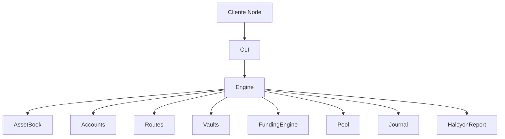
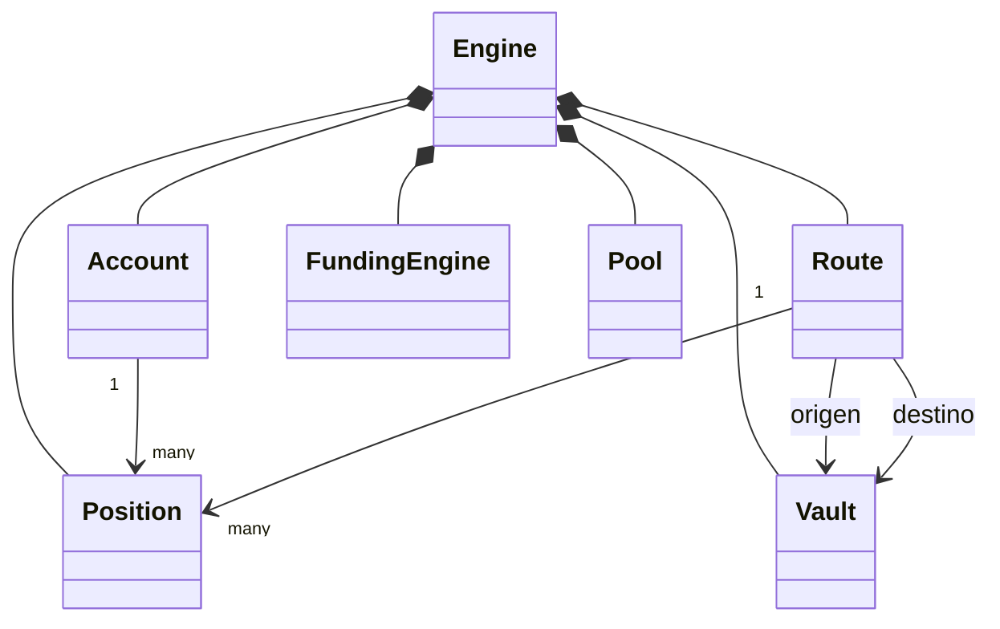
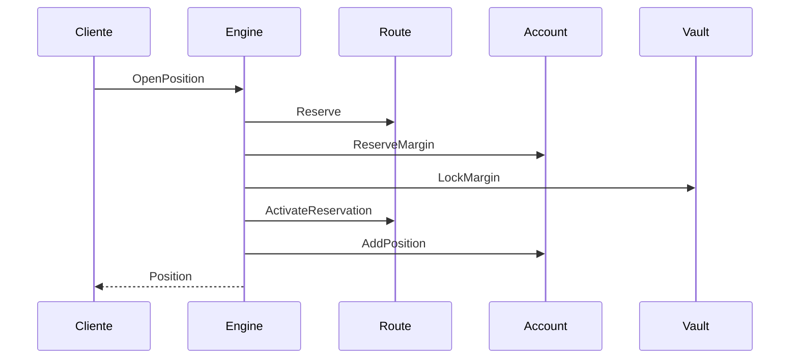

# Arquitectura

## Objetivo

HalcyonDTL separa reglas económicas, estado mutable, proyecciones y adaptadores. El proceso Go es la autoridad determinista; el cliente Node únicamente valida, invoca y consume su contrato JSON.

## Agregados

| Agregado   | Responsabilidad                   | Estado principal                |
| ---------- | --------------------------------- | ------------------------------- |
| `Account`  | Garantías, margen y posiciones    | saldos, cursor, estado          |
| `Route`    | Capacidad y curva de financiación | liquidez, utilizado, acumulador |
| `Vault`    | Custodia lógica por operador      | reserva, margen, seguro         |
| `Position` | Ciclo de una exposición           | nocional, entrada, cierre       |
| `Pool`     | Contabilidad común                | comisiones, seguro, deuda       |
| `Journal`  | Evidencia ordenada                | eventos por época               |

Los identificadores son tipos nominales y las cantidades no aceptan valores negativos. La validación se ejecuta en los límites del agregado y el motor coordina cambios que abarcan varios componentes.

## Transacción de apertura

La apertura comprueba cuenta, ruta, activo y margen antes de crear la posición. Una reserva fallida deshace la capacidad ya tomada. El evento se registra únicamente después de completar todas las mutaciones.

## Determinismo

Los mapas se serializan mediante claves ordenadas; el reloj avanza por épocas enteras; las cantidades, BPS y PPM usan `int64`; y el digest se deriva del estado canónico. El mismo escenario y versión deben producir el mismo JSON y `state_digest` en Linux y Windows.

## Límites

- No existe acceso de red en el motor.
- La persistencia y firma de instantáneas pertenecen a la capa de integración.
- Las credenciales nunca forman parte del modelo.
- La configuración de oráculo se suministra como dato validado.

Consulta [Modelo económico](modelo-economico.md) para las ecuaciones y [Operación](operacion.md) para los procedimientos de ejecución.
