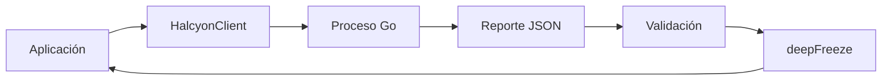
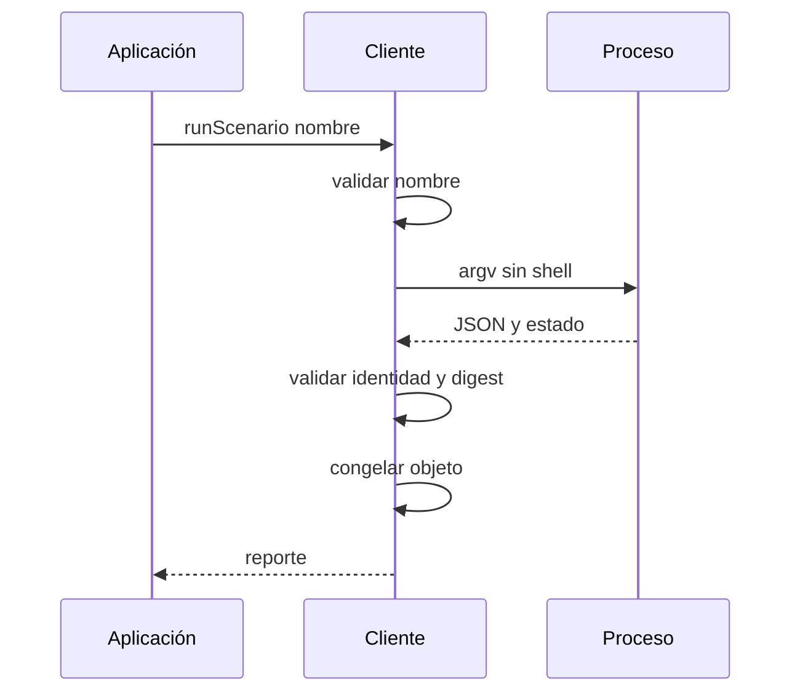
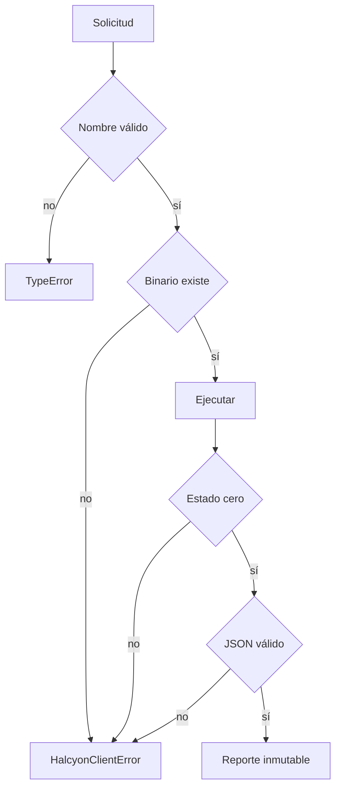

# Cliente Node

## Propósito

El paquete exporta `HalcyonClient`, `HalcyonClientError`, `assertScenarioName` y `validateReport`. El adaptador mantiene pequeña la superficie de integración y deja la lógica económica en Go.



## Uso

```js
import { HalcyonClient } from "halcyondtl";

const client = new HalcyonClient({
  binary: process.env.HALCYON_BIN,
  timeout: 5_000,
  maxBuffer: 2 * 1024 * 1024,
});

for (const name of client.listScenarios()) {
  const report = client.runScenario(name);
  console.log(name, report.state_digest);
}
```

## Frontera de proceso



No se interpolan argumentos en comandos. El nombre debe comenzar por una letra minúscula y contener sólo letras minúsculas, números o guiones, con un máximo de 48 caracteres. El proceso se oculta en Windows y se termina al superar el plazo.

## Errores

`HalcyonClientError` separa ausencia del binario, error de ejecución, rechazo del motor, JSON mal formado e incumplimiento del contrato. `details` se congela y limita `stderr` a 4096 caracteres para evitar transportar salidas sin límite.



## Integración segura

- Fija el binario mediante ruta absoluta en servicios.
- No aceptes el nombre del escenario desde una fuente sin validar.
- Conserva límites de tiempo y memoria.
- Comprueba la versión del paquete junto al commit del binario.
- Registra el digest, no el reporte completo, cuando haya datos operativos sensibles.
