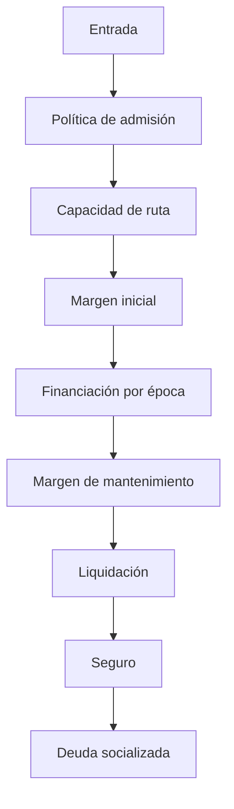
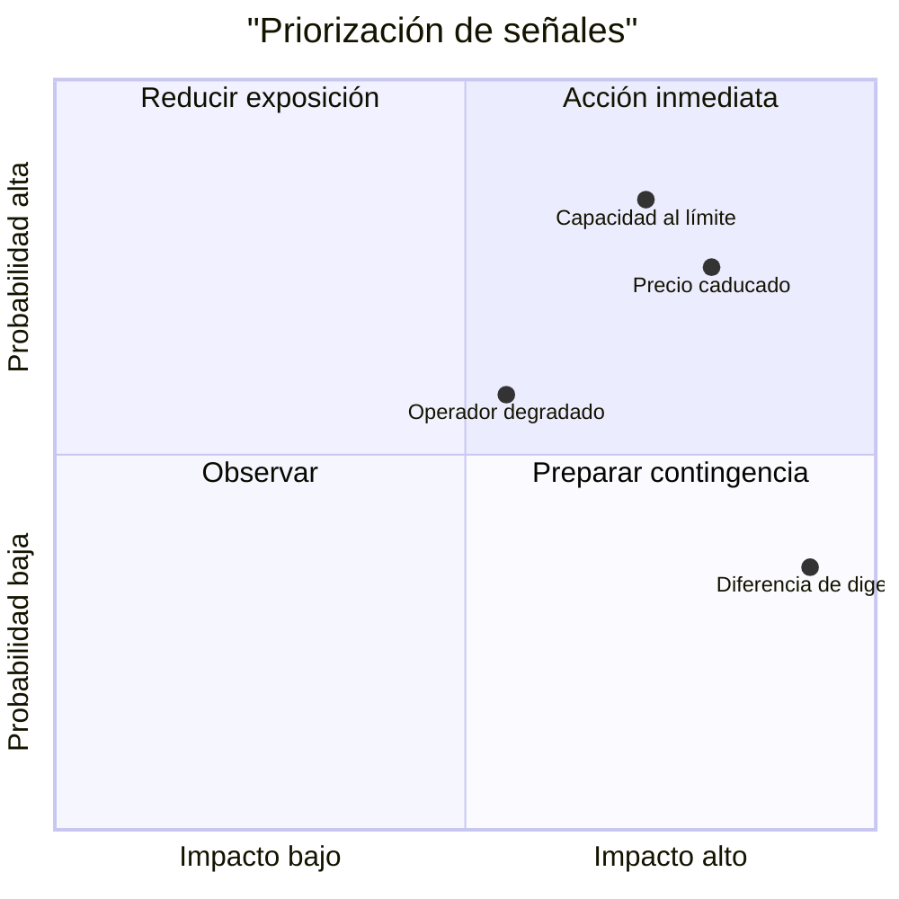
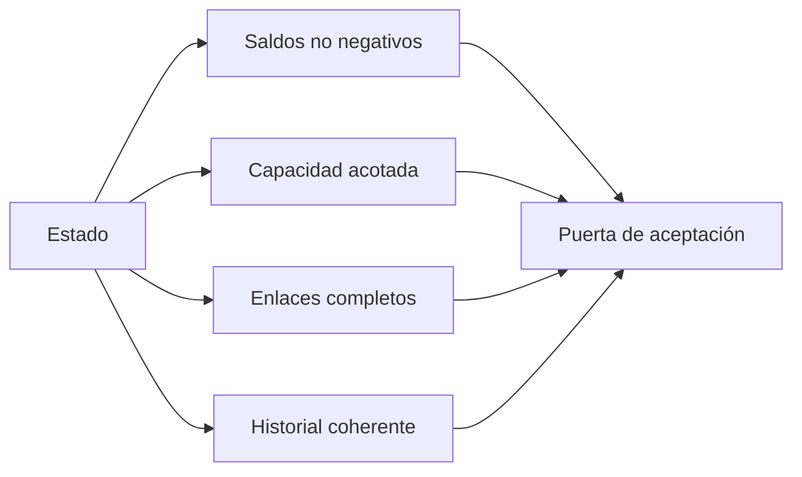

# Controles de riesgo

## Capas

El control se distribuye entre admisión, capacidad de ruta, margen, financiación, liquidación, seguro e invariantes. Ninguna señal aislada se considera suficiente.

## Límites recomendados

| Señal                |  Umbral de aviso | Acción                   |
| -------------------- | ---------------: | ------------------------ |
| utilización          |             90 % | limitar nuevas aperturas |
| utilización          |             96 % | pausar capacidad         |
| margen               | 120 % del mínimo | revisión frecuente       |
| antigüedad de precio |         2 épocas | rechazar transición      |
| déficit residual     |   mayor que cero | incidente crítico        |
| digest inesperado    | cualquier cambio | detener consumo          |

Los valores concretos deben ajustarse a liquidez, volatilidad y latencia del dominio operativo.

## Invariantes

El reporte comprueba cuentas y bóvedas no negativas, utilización dentro del máximo, enlaces de posición, correspondencia entre registros y rutas, cursores activos válidos y ausencia de posiciones cerradas en cuentas.

## Pruebas de estrés

Cada revisión de parámetros debe incluir escenario base, concentración en una ruta, recorte de valoración, coste de liquidación elevado, recuperación parcial del seguro y choque simultáneo en cartera. Se archivan entradas y resultados, no sólo el nivel final.

## Separación de funciones

La persona que propone parámetros no debe aprobar su publicación. Operaciones controla pausas; riesgo valida límites; ingeniería mantiene el motor; y seguridad verifica integridad y procedencia del artefacto.
