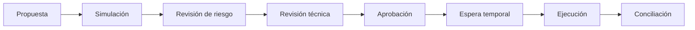
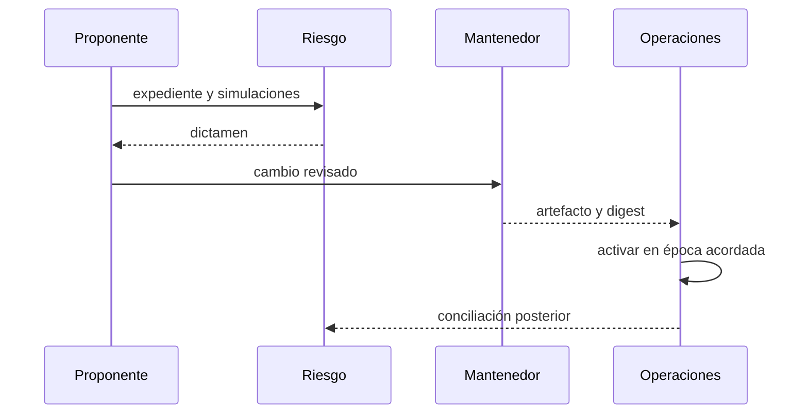
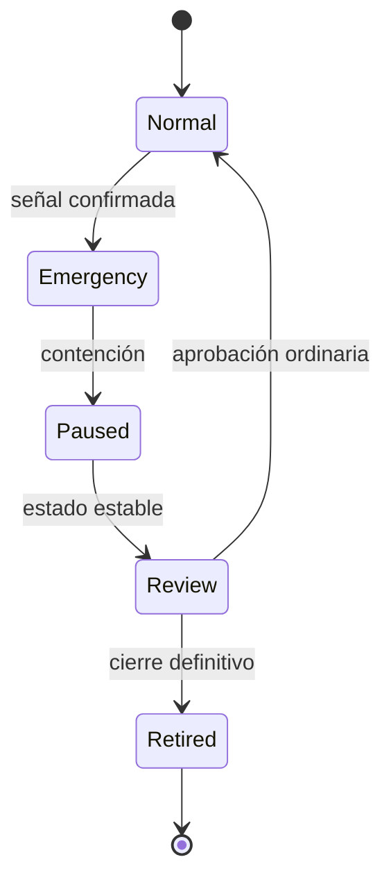

# Gobernanza

## Principios

Los cambios de parámetros deben ser explícitos, revisables, reversibles cuando sea posible y efectivos en una época conocida. Una propuesta incluye motivación, valores anterior y nuevo, simulaciones, límites y plan de reversión.

## Parámetros gobernados

- objetivo y máximo de utilización;
- pendiente y límite de financiación;
- margen inicial y de mantenimiento;
- penalización de liquidación;
- participación y recuperación del seguro;
- estado de operadores, bóvedas y rutas;
- límites de cliente y política de publicación.

## Expediente de cambio

| Campo         | Contenido mínimo            |
| ------------- | --------------------------- |
| referencia    | identificador único         |
| alcance       | rutas, activos y operadores |
| valores       | anterior, nuevo y unidad    |
| justificación | señal cuantitativa          |
| simulación    | base, adversa y extrema     |
| activación    | época y responsables        |
| reversión     | condición y procedimiento   |

## Cambios de emergencia

Una emergencia permite pausar rutas o reducir límites, pero no omitir registro, revisión posterior ni conciliación. La autoridad temporal caduca y cualquier modificación permanente vuelve al flujo ordinario.

## Separación y evidencia

Proponente, aprobador y ejecutor deben ser identidades distintas. Se conserva commit, resultado de automatización, digest del artefacto, parámetros, hora efectiva y conciliación posterior. Una etiqueta publicada es inmutable; cualquier corrección crea una versión nueva.
