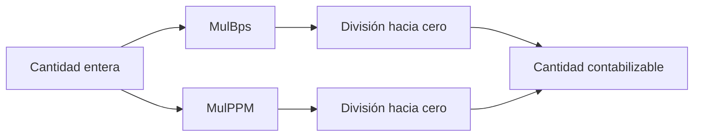
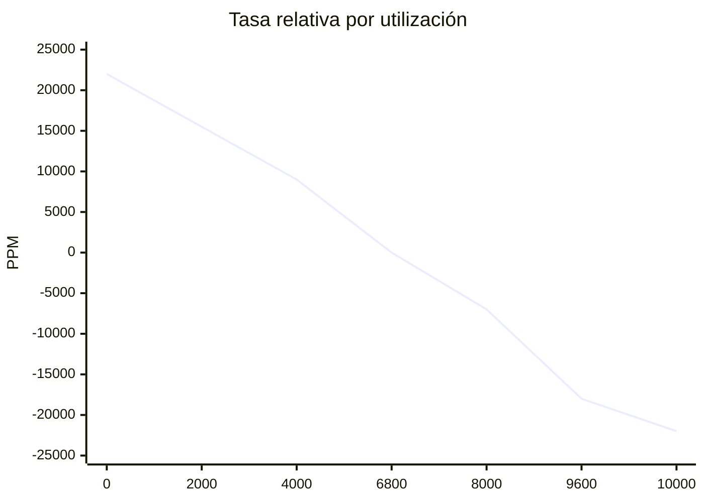
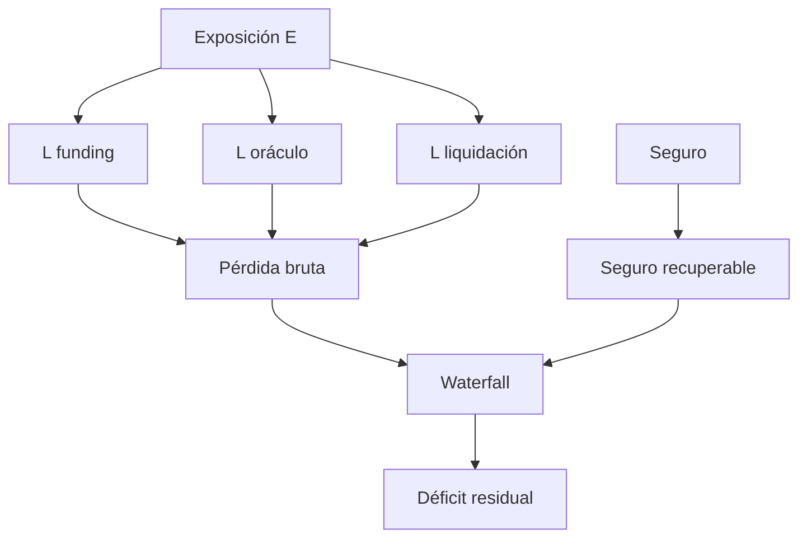

# Modelo económico

## Unidades

HalcyonDTL representa activos en sus unidades menores. Las proporciones usan BPS con escala `10 000`; la financiación usa PPM con escala `1 000 000`. No hay coma flotante en decisiones contables.



## Curva de financiación

Sea `U` la utilización en BPS, `T` el objetivo, `S` la pendiente en PPM y `C` el límite absoluto:

```text
r = clamp((T - U) × S / 10 000, -C, C)
A[n] = A[n-1] + r
F = N × (A[salida] - A[entrada]) / 1 000 000
```

La curva incentiva capacidad donde falta liquidez y cobra el desequilibrio donde la utilización supera el objetivo. El límite evita que una sola época produzca un salto no acotado.



## Capacidad

```text
capacidad = liquidez × máximoBps / 10 000 - utilizado - reservado
```

`Reserved` evita que dos aperturas concurrentes consuman la misma capacidad lógica. Al confirmar, pasa a `Utilized`; al cerrar, se libera el nocional.

## Cascada de estrés

La proyección independiente combina tres fuentes de pérdida y después aplica el seguro recuperable:

```text
E = utilizado + reservado + choque
L_funding = (utilizado + choque) × fundingShockPPM / 1 000 000
L_oracle = E × haircutBps / 10 000
L_liq = (utilizado + choque) × liquidationCostBps / 10 000
L_bruta = L_funding + L_oracle + L_liq
I_rec = seguro × recoveryBps / 10 000
déficit = max(L_bruta - min(L_bruta, I_rec), 0)
```



## Ejemplo

Para liquidez `1 000 000`, utilizado `600 000`, reservado `50 000`, choque `100 000`, financiación `20 000 PPM`, recorte `300 BPS` y coste `120 BPS`:

| Término                  | Resultado |
| ------------------------ | --------: |
| exposición               |   750 000 |
| pérdida por financiación |    14 000 |
| pérdida por oráculo      |    22 500 |
| coste de liquidación     |     8 400 |
| pérdida bruta            |    44 900 |

Con `80 000` de seguro y recuperación del `80 %`, la cobertura disponible es `64 000`; se consumen `44 900` y el déficit residual es cero.

## Cartera

`ProjectPortfolioStress` rechaza rutas duplicadas y agrega pérdida, seguro, déficit, rutas sobre capacidad y peor colchón. Las entradas permanecen independientes para que cada jurisdicción u operador pueda tener parámetros distintos.
