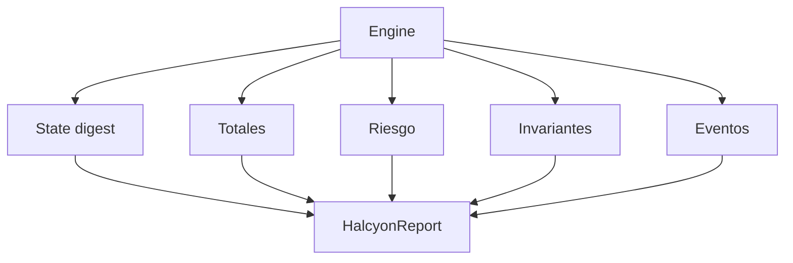
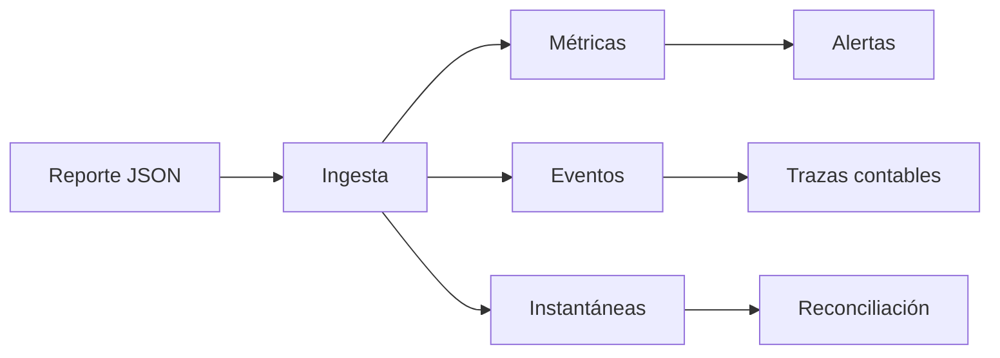
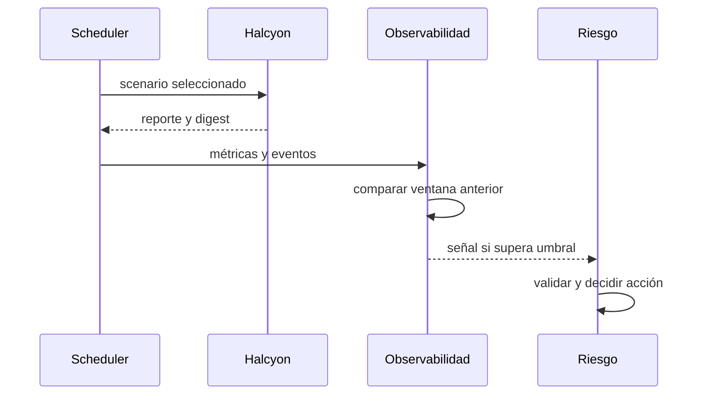

# Observabilidad

## Contrato de reporte

`HalcyonReport` reúne identidad, reloj, digest, activos, operadores, bóvedas, cuentas, rutas, posiciones, financiación, fondo común, totales, riesgo, invariantes, eventos y notas. El JSON está pensado para ingestión directa.

## Señales esenciales

| Señal                  | Tipo     | Interpretación                |
| ---------------------- | -------- | ----------------------------- |
| `clock`                | contador | época aplicada                |
| `state_digest`         | cadena   | identidad canónica del estado |
| `max_utilization_bps`  | gauge    | mayor presión de capacidad    |
| `min_margin_ratio_bps` | gauge    | menor colchón de cuenta       |
| `insurance_balance`    | gauge    | cobertura disponible          |
| `socialized_debt`      | gauge    | pérdida no absorbida          |
| `uncollected_funding`  | contador | diferencia contable acumulada |
| `event_count`          | contador | completitud del diario        |

## Alertas

Configura alertas por invariantes falsas, incremento de deuda, capacidad sobre el límite, seguro por debajo del mínimo, ausencia de épocas y cambio de digest para una entrada idéntica. Agrupa por red, ruta, activo y operador.

## Reconciliación

Una reconciliación compara colateral y margen de cuentas, reservas y margen bloqueado de bóvedas, utilizado y reservado de rutas, comisiones, seguro y deuda. Cada suma se realiza por activo para no mezclar decimales.

## Retención

Conserva el digest de cada época y una instantánea completa por ventana operativa. Los eventos pueden retenerse más tiempo porque permiten reconstruir decisiones; elimina cualquier dato adicional que no sea necesario para conciliación.
