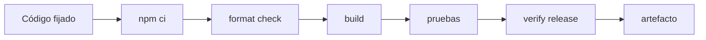
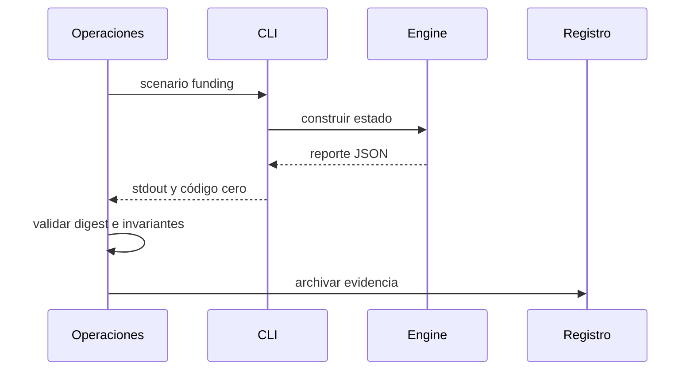
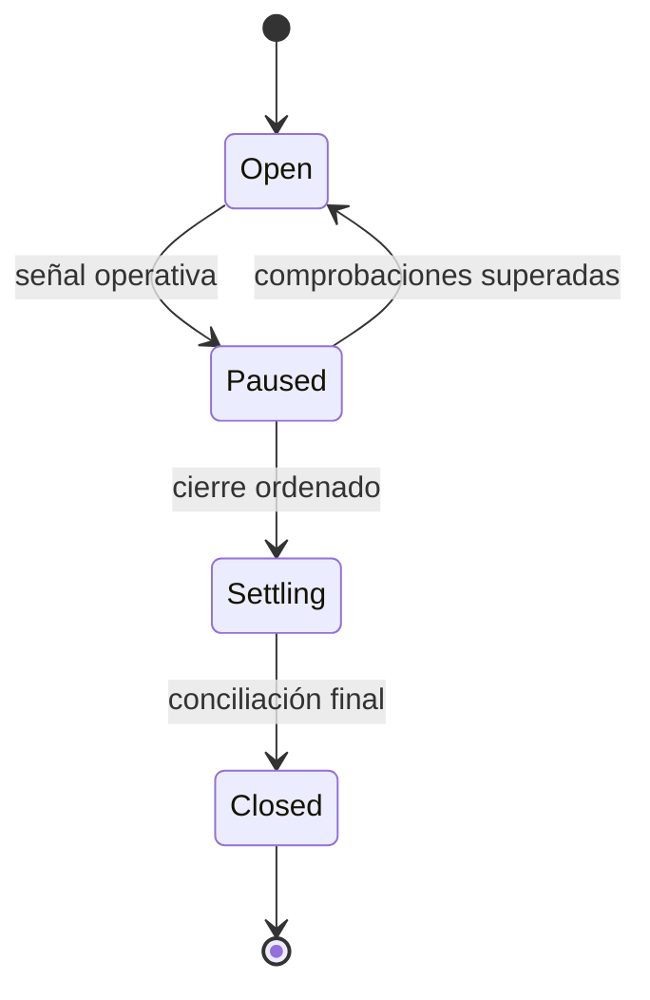

# Operación

## Preparación

Instala Go 1.22.12 y Node.js 24, ejecuta `npm ci` y conserva un árbol Git limpio. La construcción no descarga datos en tiempo de ejecución ni requiere credenciales.



## Comandos

```bash
npm run build
npm run test
npm run ci
```

El ejecutable admite `--list`, `scenario <nombre>` y `validate <nombre>`. `scenario` produce JSON por `stdout`; los diagnósticos se reservan para `stderr` y los códigos distintos de cero indican rechazo.

## Procedimiento diario

1. Comprobar el commit y el estado del árbol.
2. Ejecutar la puerta local completa.
3. Generar el escenario requerido.
4. Verificar `state_digest` y todas las invariantes.
5. Archivar salida, versión, plataforma y hora.
6. Comparar totales con la instantánea anterior.



## Pausa de ruta

Una ruta se pausa cuando la fuente de precios está caducada, se supera el umbral de utilización, un operador pierde disponibilidad o la conciliación no converge. La pausa bloquea nueva capacidad, mantiene posiciones existentes y conserva el historial.



## Recuperación

- Congelar nuevas aperturas antes de reconstruir estado.
- Restaurar desde una instantánea con digest conocido.
- Reprocesar eventos en orden estricto de época.
- Comparar saldos por activo, ruta y bóveda.
- Reanudar sólo después de dos ejecuciones deterministas coincidentes.

## Publicación

Los cambios entran mediante una solicitud revisada. Tras integrar en `main`, se crea o actualiza `production` al mismo commit, se espera su matriz, se crea la etiqueta anotada `v1.0.0` y se publica la versión. No se reutiliza una etiqueta para otro commit.
